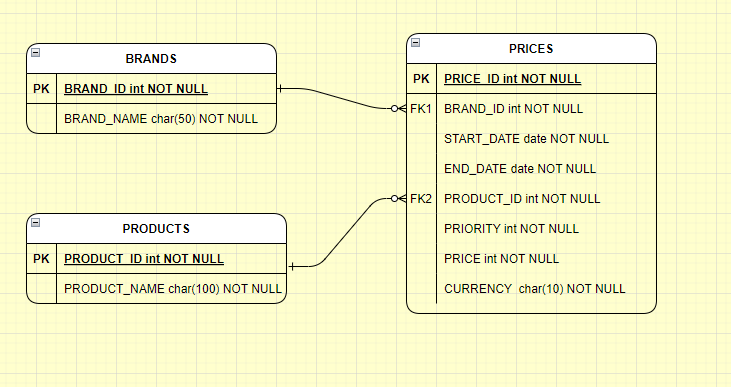

# **E-commerce Pricing Service**

## **Descripción del Proyecto**

El proyecto a continuación presenta una solución al caso de consulta de precios aplicados en Inditex, se realiza bajo lenguaje de programacion Java con el marco de trabajo SpringBoot y base de datos H2. Adicionalmente, se complementa utilizando arquitectura hexagonal.

---

## **Tecnologías Utilizadas**

- **Frameworks y Librerías**:
  - Spring Boot 3.3.2
  - Spring Data JPA
  - H2 Database
  - SpringDoc OpenAPI
  - Maven

- **Arquitectura**:
  - Hexagonal (Ports and Adapters)

- **Testing**:
  - JUnit 5
  - Mockito
  
## Base de datos 

Diagrama relacional de la base de datos



---
## **Instalación**

<bold>Pre-requisitos:</bold>
  - Maven
  - Lombok
  
Clonar el repositorio

```
git clone https://github.com/jomiol1/ecommerce
cd ecommerce
```

Generar proyecto por maven

```
mvn clean install
```

Ejecutar proyecto por maven

```
mvn spring-boot:run

```
### Uso

Luego de ejecutar el proyecto, podemos visualizar la información de la api a través de la herramienta swagger con el siguiente link de acceso: [http://localhost:8080/swagger-ui.html#/](http://localhost:8080/swagger-ui.html#/ "Swagger UI")
<br> Adicionalmente se puede utilizar la colección de Postman con los casos de prueba adjunto al proyeto

### Consulta de precio aplicado


<bold>Endpoint para consultar precio aplicado a un producto especifico:</bold>

```
GET /v1/inditex/price   

```

<bold>Parámetros de consulta:</bold>
  - date (String): (ej. 2020-06-14T18:00:00).
  - productId (Integer): Identificador del producto.
  - brandId (Integer): Identificador de la cadena.
  
<bold>Ejemplo de Solicitud:</bold>

```
curl -X GET "http://localhost:8080/v1/inditex/price?date=2020-06-14T10:00:00&productId=35455&brandId=1"
  

```
<bold>Ejemplo de Respuesta:</bold>
```
{
    "id": 1,
    "product": "camisa lino",
    "brand": "Zara",
    "price": "35.50",
    "startDate": "2020-06-13T22:00:00.000+00:00",
    "endDate": "2020-12-31T22:59:59.000+00:00"
}

  

```

